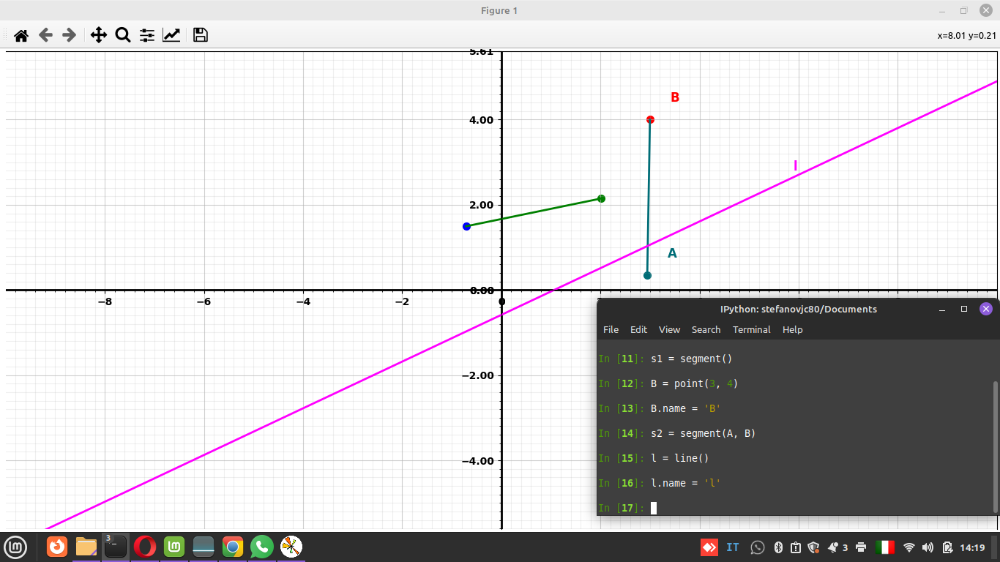
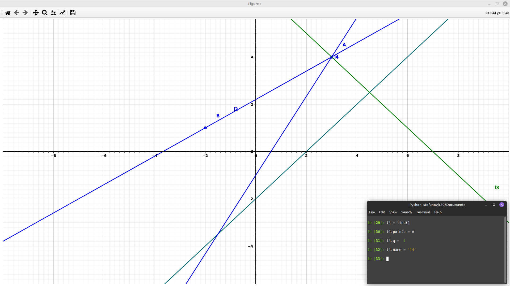
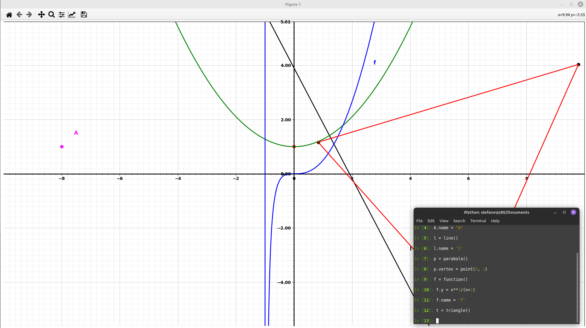
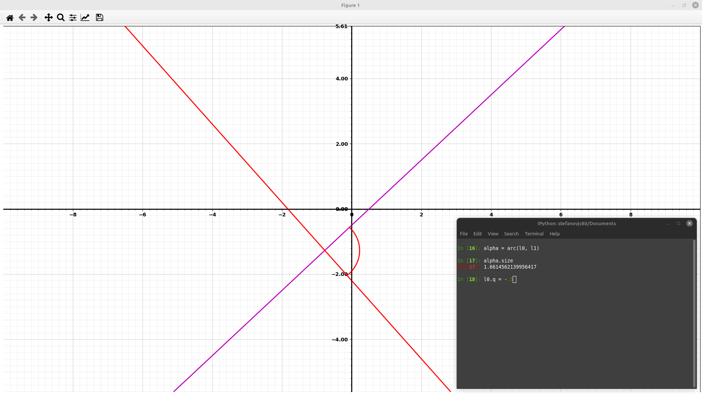
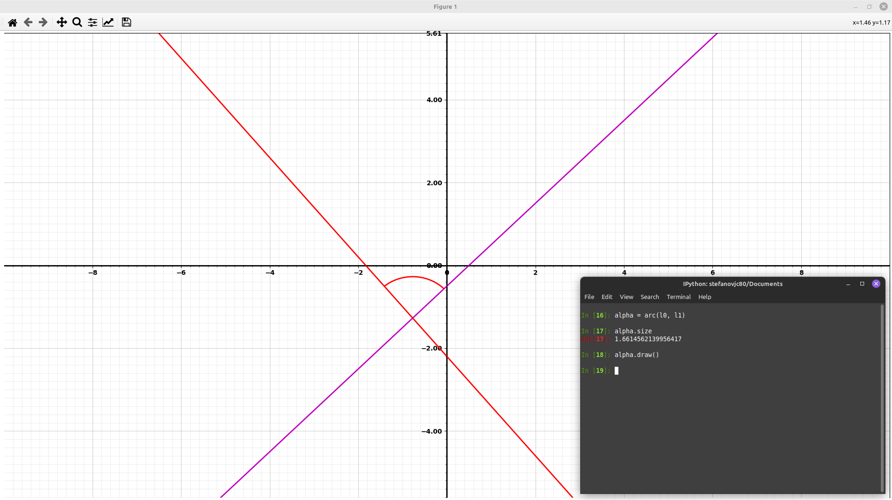
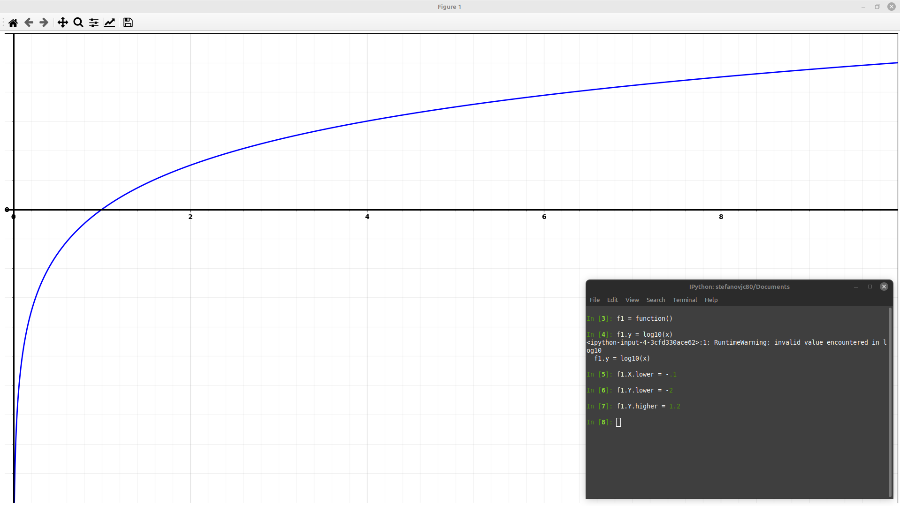
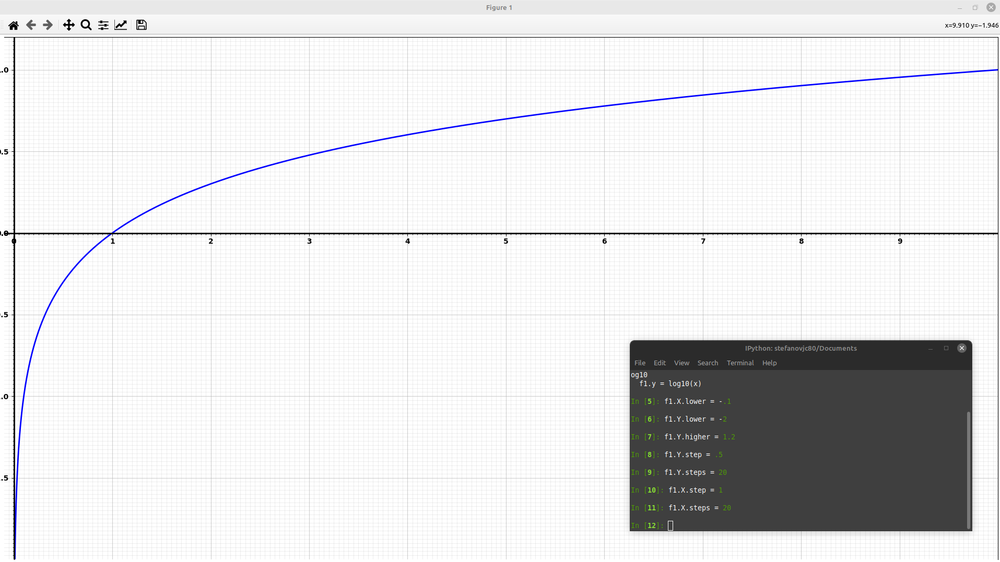
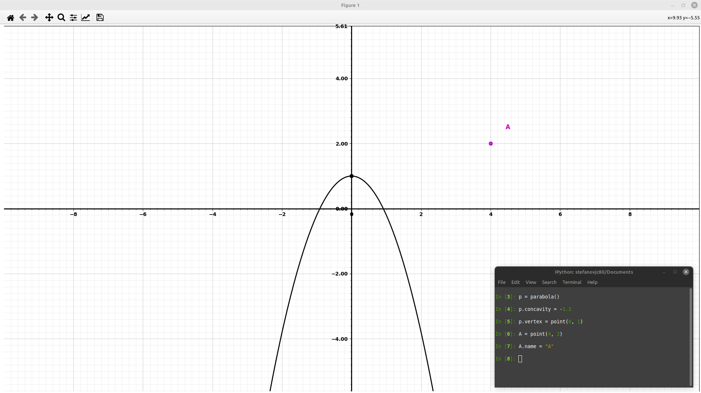

**As this project is rapidly evolving, the current README file provides only a preliminary explanation of its functionality and operation. Hopefully, an accurate and comprehensive README file will be available soon.**

The present project, primarily built on top of matplotlib and numpy python libreries, is designed specifically for fast and easy geometric loci visualization with python.

Although there are already many existing standalone applications such as GeoGebra, the different concept of the present project makes it suitable as a valuable tool for coding learning. 

 
In fact, while there are numerous Python libraries and software tools available for scientific purposes, many of them are often too much complex and challenging; which makes them prohibitive for educational use. 

As I personally believe that coding is a skill that can be acquired only by tackling real tasks rather than through simple exercises, the present project is intended to be a valuable occasion to introduce students to computer programming with python, while supporting them with their mathematical tasks.

# Installation and start up

Make sure you have matplotlib, random and numpy libraries installed on a fully working Ipython environment. Download the present project and rename it's folder with "geompy".

Open a console, move it where the geompy folder is located, start off an ipython session and import all modules

`from geompy import *`

a new window with a Cartesian plane comes up

 

If everything works fine, than jump over next section. In case of any error message, due to any package version mismatch, than you need to create a 'analyticGeomEnv' conda environment. So, go back to your OS console, on the "analyticGeometry" folder and type

`conda env create -f analyticGeomEnv.yml`

`conda activate analyticGeomEnv`.

(it may take time, depending on the available connection speed). Once activated, try again to run main.py on your ipython interpreter, as previously explained.

# Usage

After loading geompy into IPython, let's consider drawing a circumference. You can create a "circumference" type instance, labeled "c", by typing:

`c = circumference()`

Here "c" is a python variable, simultaneously a circumference with random center coordinates and a random radius value is drawn in the plot window.

by typing

`c.radius = 4`

the .radius attribute of the "c" instance is being modified. Should you need your "c" circumference centered at P(1, 2) and having a thin line width, than you can modify its corrispective attributes accordingly:

`c.center = point(1, 2)`

`c.linewidth = 1`

# Draw points, segments and lines

As further examples you can generate two points and a line by typing

`A = point() #random coordinates`

`A.name = "A"`

`s1 = segment() #random segment`

`B = point(3, 4)`

`B.name = "B"`

`s2 = segment(A, B) #segment with A and B as endpoints`

`B = point(3, 4)`

`l = line()`

and you can modify them by typing

`A.x = -2`

`l.m = -1`

`l.q = 1.2`

where "l.m" and "l.q" are the angular coefficient and the intercept respectively.

- Select randomly a point among the ones of the "c" geometrical locus

`P = point(c)`

- Choose a point by mouse click:

the .click method, allows the user to manually select the point with the mouse. It has to be called two times:

`P.click("P")`

**Draw a line from angular coefficient "m" and intercept "q"**

`l1 = line()`

`l1.m = 1`

`l1.q = -2`

`l1.name = "l1"`

**Draw a line passing through two different point: A and B respectively**

`A = point(3, 4)`

`A.name = 'A'`

`B = point(-2, 1)`

`l2 = line()`

`l2.name = "l2"`

`l2.points = A`

`l2.points = B`

`l2.name = "l2"`

**Draw a line passing through one point, say point A, and having a specific angular coefficient "m"**

`l3 = lines()`

`l3.points = A`

`l3.m = -1`

`l3.name = "l3"`

**Draw a line passing through one point, say point A, and having a specific y-intercept "q"**

`l4 = line()`

`l4.points = A`

`l4.q = -1`

`l4.name = "l4"`

# Geometrical loci classes and attributes managing 

Here a comprensive list of all classes available in geompy

`point()`

`line()`

`segment()`

`parabola()`

`ellipse()` (still to be further improved!)

`hyperbole()` (still to be developed!)

`function()`

`triangle()`

`arc()`

and here some examples about how they can be used

`A = point(-8, 1)`

`A.name = 'A'`

`l = line()`

`l.name = 'l'`

`p = parabola()`

`p.vertex = point(0, 1)`

`f = function()`

`f.y = x**3/(x+1)`

`f.name = 'f'`

`t = triangle()`

Each geompy class has attributes which set it's geometrical specifications. Some of these attributes available are the some for all types of classes (such as .color or .linewidth), while others are specific of the type of geometrical locus (such as .radius and .center). To view a comprehensive list of attributes that can be modified, simply type:

`print(c)`

As an example, one of the listed attributes is "color," allowing you to set the color of the circumference:

`c.color = "blue" # or simply c.color = "b"`

the .color attribute can be choosen from the following list

- ``'b'``          blue

- ``'g'``          green

- ``'r'``          red

- ``'azure'``      azure

- ``'m'``          magenta

- ``'y'``          yellow

- ``'k'``          black

- ``'w'``          white

This flexibility extends to drawing and managing all other geometrical loci which are available as geompy classes and can be found from the list of ipython variables

# Data visualization 

- A numbered list of all points coordinates calculated into c instance

`c.points `

- A list of all x values calculated into c instance

`c.x`

- A list of all y values calculated into c instance

`c.y`

Explore the following examples:

### - [parabola](#draw-a-random-parabola)

`p = parabola()`

`p.vertex = point(0, 0)`

# Parabola/circumference passing through three points

Draw a circumference/parabola passing through three points:

`A = point(4, 1)`

`B = point(1, 6)`

`C = point(-2, -4)`

`c1 = circumference()`

`c1.points = A`

`c1.points = B`

`c1.points = C`

# Line tangent to a circumference and passing through a given point

`P = point(8, 2)`

`t1 = c1.tangent(P)`

`t2 = c1.tangent(P)`

# Labeling

You can choose a simple string type labeling or even a latex formula, as follows

`P.name = "P"`

`A.name = "A"`

`B.name = "B"`

`C.name = "C"`

`c.name = "c"`

`c1.name = "c1"`

`p.name = "p"`

or

`c1.name = r"$(x -1 )^2 + (y - 2)^2 = 16$"`

`P.name = "P(8, 2)"`

# Cut Off data

Let consider a straight line with angular coefficient 0.2 and intercept 1.2:

`l1 = line()`

`l1.m = .2`

`l1.q = 1.2`

by typing

`l1.X.cut = -4`

all points with x value before -4 are removed, by typing again

`l1.X.cut = 2`

all poits with x values after 2 are removed

# Arcs drawing

The arc class takes two lines as argument

`l0 = line()`

`l1 = line()`

`l0.m = 1`

`l0.m = -1.2`

`l0.q = -.5`

`l1.q = -2.2`

`alpha = arc(l0, l1)`

`alpha.size`

by typing

`alpha.draw()`

# Plot settings

Choose one of the instances you have used so far (in this example P) and change the plot size and grid as follows

- `P.lower = -20`

set both left and bottom coordinates to -20

- `P.higher = 20`

set both right and up coordinates to -20

- `P.step = 2`

set major grid step to 2

- `P.steps = 20`

set the number of minor steps in between two adjacent major steps to 20

Let say you need to adjust limits of X only coordinate or Y only coordinate.

`f1 = function()`

`f1.y = log10(x)`

`f1.X.lower = -.1`

`f1.Y.lower = -2`

`f1.Y.higher = 1.2`

`f1.X.lower = -.1`

`f1.Y.lower = -2`

`f1.Y.higher = 1.2`

`f1.Y.step = .5`

`f1.Y.steps = 20`

`f1.X.step = 1`

`f1.X.steps = 20`

# Rotation

`p = parabola()`

`p.concavity = -1.2`

`p.vertex = point(0, 1)`

`A = point(4, 2)`

`A.name = 'A'`

`A.rotation(p, angle = -pi/3)`

